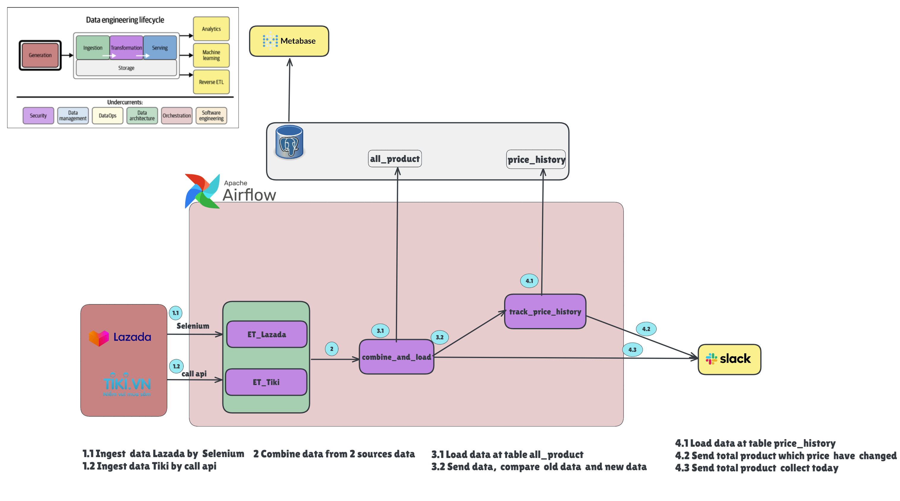

# Xây Dựng Apache Airflow Pipeline cho Thu Thập và Trực Quan Hóa Dữ Liệu E-Commerce: Hỗ Trợ Ra Quyết Định Kinh Doanh cho Nhà Bán Hàng và người mua

## Cung Cấp Insight Thị Trường E-Commerce cho Nhà Bán Hàng và người dùng Tiki & Lazada

Pipeline tự động crawl, xử lý và trực quan hóa dữ liệu sản phẩm từ Tiki và Lazada sử dụng Apache Airflow, PostgreSQL và Metabase.

## 📋 Mục Lục

- [Tổng Quan](#-tổng-quan)
- [Kiến Trúc](#-kiến-trúc)
- [Cài Đặt](#-cài-đặt)
- [Sử Dụng](#-sử-dụng)
- [Database Schema](#-database-schema)
- [Cấu Trúc Project](#-cấu-trúc-project)
- [Troubleshooting](#-troubleshooting)

## 🎯 Tổng Quan

Pipeline này thực hiện các công việc sau:

1. **Extract**: Crawl dữ liệu sản phẩm từ 2 nguồn
   - **Tiki**: Sử dụng API (nhanh, ổn định)
   - **Lazada**: Sử dụng Selenium (vì có JavaScript rendering)

2. **Transform**: Làm sạch và chuẩn hóa dữ liệu
   - Parse giá (loại bỏ ký tự đặc biệt)
   - Chuẩn hóa số lượng bán (xử lý notation 'k')
   - Phân loại brand và category
   - Extract review count và score

3. **Load**: Lưu vào PostgreSQL
   - Upsert vào bảng `all_products` (snapshot hiện tại)
   - Track lịch sử trong `price_history` (time-series data)

4. **Notify**: Gửi thông báo qua Slack
   - Success notification với statistics
   - Error alerts với log links

## 🏗️ Kiến Trúc



### Components

- **Airflow Webserver**: Web UI (http://localhost:8080)
- **Airflow Scheduler**: Lên lịch và điều phối tasks
- **Airflow Worker**: Chạy ETL code (Celery executor)
- **PostgreSQL Metadata**: Lưu Airflow state
- **PostgreSQL Data Warehouse**: Lưu business data
- **Redis**: Message broker cho Celery
- **Metabase**: BI tool (http://localhost:3000)

## 🚀 Cài Đặt

### Prerequisites

- Docker Desktop 4.0+
- Docker Compose 2.0+
- 8GB RAM minimum (16GB recommended)
- 20GB disk space

### Bước 1: Clone Project

```bash
git clone <repo-url>
cd airflow-project1
```

### Bước 2: Cấu Hình Environment

Copy và chỉnh sửa `.env`:

```bash
cp .env.example .env
# Sửa passwords trong .env (nếu cần)
```

### Bước 3: Build và Start Services

```bash
# Build Docker image
docker-compose build

# Start tất cả services
docker-compose up -d

# Xem logs
docker-compose logs -f
```

### Bước 4: Truy Cập Services

- **Airflow UI**: http://localhost:8080
  - Username: `airflow`
  - Password: `airflow`

- **Metabase**: http://localhost:3000
  - Setup lần đầu: Chọn PostgreSQL
  - Host: `postgres-data`
  - Port: `5432`
  - Database: `mydatabase`
  - Username: `myuser`
  - Password: `mypassword`

### Bước 5: Cấu Hình Airflow Connections

Trong Airflow UI, thêm 2 connections:

#### 1. PostgreSQL Data Warehouse

```
Admin -> Connections -> Add Connection
- Connection Id: postgres_data_conn
- Connection Type: Postgres
- Host: postgres-data
- Schema: mydatabase
- Login: myuser
- Password: mypassword
- Port: 5432
```

#### 2. Slack Webhook (Optional)

```
Admin -> Connections -> Add Connection
- Connection Id: slack_webhook_conn
- Connection Type: HTTP
- Host: https://hooks.slack.com
- Password: <your-webhook-token>
```

## 💻 Sử Dụng

### Chạy Pipeline Manually

1. Vào Airflow UI: http://localhost:8080
2. Tìm DAG: `master_tiki_lazada_pipeline`
3. Click toggle để enable DAG
4. Click "Trigger DAG" để chạy ngay

### Schedule Automatic

Pipeline mặc định chạy **@daily** (00:00 hàng ngày).

Để thay đổi schedule, sửa trong `dags/master_pipeline.py`:

```python
@dag(
    schedule_interval="@daily",  # Hoặc "0 2 * * *" cho 2:00 AM
    ...
)
```

### Xem Logs

```bash
# Logs của tất cả services
docker-compose logs -f

# Logs của service cụ thể
docker-compose logs -f airflow-worker

# Task logs trong Airflow UI
# DAGs -> master_tiki_lazada_pipeline -> Task Instance -> View Log
```

## 📊 Database Schema

### Table: `all_products`

Snapshot sản phẩm hiện tại (upsert daily).

| Column | Type | Description |
|--------|------|-------------|
| id | SERIAL | Primary key |
| name | TEXT | Tên sản phẩm |
| price | INT | Giá (VNĐ) |
| sold_count | INT | Số lượng đã bán |
| review_count | INT | Số lượng đánh giá |
| review_score | DECIMAL(3,2) | Điểm đánh giá (0-5) |
| brand | TEXT | Thương hiệu (Apple, Samsung, ...) |
| category | TEXT | Loại sản phẩm (Điện thoại, Laptop, ...) |
| source | TEXT | Nguồn (Tiki, Lazada) |
| crawled_at | TIMESTAMP | Thời gian crawl |

**Unique constraint**: `(name, source)`

### Table: `price_history`

Lịch sử giá và sold count theo ngày (time-series).

| Column | Type | Description |
|--------|------|-------------|
| id | SERIAL | Primary key |
| name | TEXT | Tên sản phẩm |
| source | TEXT | Nguồn |
| price | INT | Giá tại thời điểm |
| sold_count | INT | Số lượng bán tại thời điểm |
| review_count | INT | Số đánh giá |
| review_score | DECIMAL(3,2) | Điểm đánh giá |
| brand | TEXT | Thương hiệu |
| category | TEXT | Loại sản phẩm |
| crawl_date | DATE | Ngày crawl |
| created_at | TIMESTAMP | Timestamp tạo record |

**Unique constraint**: `(name, source, crawl_date)`


## 📁 Cấu Trúc Project

```
airflow-project1/
├── dags/
│   └── master_pipeline.py          # Main DAG definition
├── includes/
│   ├── etl_tiki.py                 # Tiki ETL module (API)
│   └── etl_lazada.py               # Lazada ETL module (Selenium)
├── logs/                           # Airflow task logs (auto-generated)
├── docker-compose.yaml             # Docker services definition
├── Dockerfile                      # Custom Airflow image
├── requirements.txt                # Python dependencies
├── .env                            # Environment variables (DO NOT COMMIT)
├── .env.example                    # Environment template (safe to commit)
├── .gitignore                      # Git ignore rules
└── README.md                       # Documentation
```

## 🔍 Troubleshooting

### Issue: "Permission Denied" khi start containers

**Solution**: Set AIRFLOW_UID trong `.env` bằng UID của user hiện tại

```bash
# Linux/Mac
echo "AIRFLOW_UID=$(id -u)" >> .env

# Windows WSL
echo "AIRFLOW_UID=1000" >> .env

# Restart
docker-compose down
docker-compose up -d
```

### Issue: ChromeDriver not found

**Solution**: Rebuild Docker image

```bash
docker-compose down
docker-compose build --no-cache
docker-compose up -d
```

### Issue: Task fails với "Connection refused" (Postgres)

**Solution**: Kiểm tra connection trong Airflow UI

1. Admin -> Connections -> `postgres_data_conn`
2. Test connection
3. Nếu fail, check host = `postgres-data` (không phải localhost)

### Issue: Out of Memory

**Solution**: Tăng Docker memory limit

- Docker Desktop -> Settings -> Resources
- Memory: Tăng lên 8GB+
- Restart Docker

### Issue: DAGs không xuất hiện

**Solution**: Check Airflow logs

```bash
docker-compose logs airflow-scheduler | grep -i error
docker-compose logs airflow-webserver | grep -i error
```

Thường do syntax error trong DAG files.

### Reset Database

Để reset toàn bộ data và start fresh:

```bash
# Stop và xóa containers + volumes
docker-compose down -v

# Start lại
docker-compose up -d
```

## 🤝 Contributing

1. Fork project
2. Create feature branch
3. Commit changes
4. Push to branch
5. Create Pull Request


## Bổ sung
docker run --rm --entrypoint bash apache/airflow:2.8.1 -c "airflow db init >/dev/null 2>&1 && cat /opt/airflow/airflow.cfg" > config/airflow.cfg